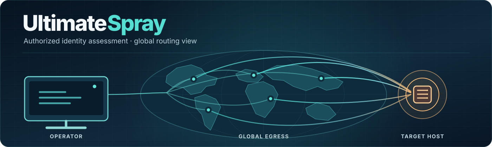

# 

UltimateSpray manages AWS API Gateway pass-through proxies for authorized
identity-security assessments, including controlled password-spray testing.
It supports multi-region proxy management and an offline preview of test inputs
and report structure. It is a modernized fork of
[FireProx](https://github.com/ustayready/fireprox) by Black Hills Information
Security.

> ⚠️ **Authorized use only.** Use this tool only against systems you own or have
> explicit written permission to test. Misuse may violate the
> [AWS Acceptable Use Policy](https://aws.amazon.com/aup/) and the law.

## Assessment overview

The banner illustrates one operator connecting through distributed proxy routes
to an approved target host. It is a conceptual view; the route drawing does not
claim a distinct IP for every request or prove an authentication outcome.

At a high level, an assessment moves through four stages:

| Stage | Purpose |
| --- | --- |
| Scope | Define the authorized targets and test boundaries. |
| Infrastructure | Manage the AWS API Gateway resources used by the assessment. |
| Identity | Observe responses from the approved identity surface. |
| Evidence | Record outcomes with enough context to distinguish confirmed results from inconclusive responses. |

The proxy manager handles infrastructure; an HTTP redirect or status code alone
does not prove that a credential is valid. `simulate` makes no network requests
and reports every account as `not_tested`.

## What's new vs. FireProx

- **Simple subcommands** with positional args and sane defaults (region defaults
  to `us-east-1`, credentials auto-resolved).
- **`cleanup`** — delete tagged proxies the tool created in one command.
- **Multi-region create** — `create <url> --regions us-east-1,eu-west-1` spins up
  a managed proxy in each selected region.
- **`RotatingProxy` helper** (`ultimatespray.spray`) — a `requests.Session`
  wrapper that round-robins a proxy pool. Forwarded-header spoofing is off by default.
- **`--json` output**, proper logging, installable package (`ultimatespray` / `us`
  console scripts), slim non-root Docker image, and CI.
- Backward compatible: the legacy `--command create --url ...` interface still
  works (with a deprecation warning).

## Installation

```bash
git clone https://github.com/borbollanetwork/UltimateSpray
cd UltimateSpray
python -m venv .venv && source .venv/bin/activate
pip install .            # or: pip install ".[examples,dev]"
```

Requires Python 3.9+ and AWS credentials (an access key/secret, a named profile,
or any source in the standard boto3 chain).

## Usage

```bash
# Create a proxy pointing at a target
ultimatespray create https://target.example.com

# Create across several regions at once
ultimatespray create https://target.example.com --regions us-east-1,eu-west-1

# List, update, delete
ultimatespray list
ultimatespray update <api_id> https://new-target.example.com
ultimatespray delete <api_id>

# Delete tagged proxies this tool created (in the current region)
ultimatespray cleanup --yes

# Smoke-test a proxy
ultimatespray spray-check https://<id>.execute-api.us-east-1.amazonaws.com/ultimatespray/

# Machine-readable output
ultimatespray --json list
```

`us` is a short alias for `ultimatespray`.

### Offline preview

`simulate` reads a user list, prompts for a password without echoing it, and
writes a JSON preview. It does not send requests or create AWS resources. Every
user is reported as `not_tested`; it never claims a credential match.

```bash
ultimatespray simulate --users ./lab-users.txt \
  --url https://lab.example.test/login --output ./preview.json
```

Omit the three options to enter the file path, URL, and output path interactively.
The password is never included in the report. The output file must not exist yet.

### Credentials

Resolved in this order:

1. `--access-key` + `--secret-access-key` (+ optional `--session-token`)
2. `--profile <name>` (read from `~/.aws/`)
3. The ambient boto3 chain (env vars, SSO, instance profile)

Explicit access keys take precedence over `--profile` and are never saved by the tool.
New proxies are tagged `ultimatespray:managed=true`; `cleanup` deletes only tagged
proxies. Existing untagged proxies must be deleted by API ID. AWS credentials need
permission to tag resources and read tags for these commands.

## Library / spraying

```python
from ultimatespray.spray import RotatingProxy

proxy = RotatingProxy([
    "https://id1.execute-api.us-east-1.amazonaws.com/ultimatespray/",
    "https://id2.execute-api.eu-west-1.amazonaws.com/ultimatespray/",
])
resp = proxy.post("/login", data={"username": "admin", "password": "Winter2026!"})
print(resp.status_code)
```

See [`examples/spray_example.py`](examples/spray_example.py) for a full spray
runner, and [`examples/google.py`](examples/google.py) /
[`examples/bing.py`](examples/bing.py) for scraping.

## Docker

```bash
docker build -t ultimatespray .
docker run --rm -it \
  -e AWS_ACCESS_KEY_ID -e AWS_SECRET_ACCESS_KEY -e AWS_DEFAULT_REGION \
  ultimatespray list
```

## Development

```bash
pip install ".[dev,examples]"
ruff check .
pytest -q
```

## Credit

Original technique and tool: [FireProx](https://github.com/ustayready/fireprox)
by Mike Felch (@ustayready) / Black Hills Information Security, building on work
by Ryan Hanson and Mike Hodges. The `X-Forwarded-For` strip patch is by Fred
Reimer.

## License

See [LICENSE](LICENSE).
